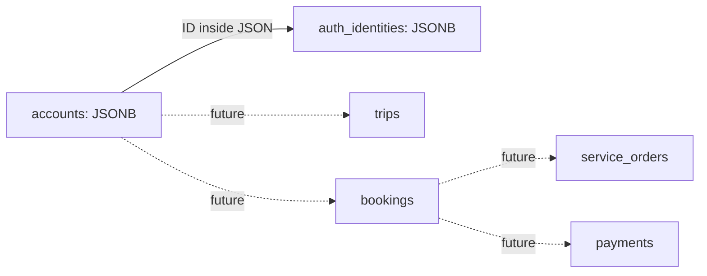

# JSONB backend foundation

Feature branch: `backend/database-foundation`. This backend lives in V1.0, which contains the full Phase 3 specification. V1.1 is a separate customer frontend and is not wired to this backend yet.

## Scope

Accounts and Google authentication identities are JSONB documents with UUID IDs, versioned envelopes, revision counters, and timestamps. There are no foreign keys or Prisma relations. The backend creates an account and its Google identity in one transaction. Google identity uniqueness is enforced by an expression index over `provider` and `providerSubject`, not by email. Different identities can share an email; account linking is a separate authenticated workflow.

New accounts default to traveler, active, onboarding pending. Role assignment and account status changes are trusted server operations. These modules expose no public API and do not implement token verification, sign-in, sessions, passwords, or automatic account linking. The future Google login feature must verify Google claims before calling account operations and must enforce account status before granting a session. Google identities contain no access tokens, refresh tokens, or passwords.

Each update uses the expected revision, increments it atomically, and rejects stale writes. Zod validates document writes and reads; SQL checks reject invalid required fields even when bypassing the application. Schema version 1 is the only supported format; future document changes need coordinated application and SQL migrations. JSON references need service-level validation. No hard-delete service is provided; use account status until retention/deletion policies are designed.

## Setup

Use PostgreSQL 16 or later. Set `DOCUMENT_DATABASE_URL` in `.env.local` or the process environment, using `schema=travelbuddy_backend`. The namespace is required so the legacy relational demo remains separate. Keep credentials out of source control.

From V1.0:

```powershell
npm run db:documents:generate
npm run db:documents:validate
npm run db:documents:deploy
npm run test:documents
```

Deploy applies only the versioned migrations under `prisma/documents/migrations`; it does not seed demo accounts or reset tables. Client generation runs during dependency installation and requires no live database. The client is generated into ignored `src/generated/documents`. Do not use `db push` for the document backend: the migration contains JSON checks and expression indexes that Prisma cannot represent in its schema. Backend clients are constructed lazily so frontend builds do not require database credentials.

The legacy `db:push` and `db:seed` commands still belong to the original relational prototype. Do not point their `DATABASE_URL` at the document namespace.

## Integration verification

Use a separate disposable PostgreSQL database. Deploy this migration to it first by temporarily setting `DOCUMENT_DATABASE_URL` to its URL and running `db:documents:deploy`. Then restore the application URL and set `DOCUMENT_TEST_DATABASE_URL` to the test URL, with `schema=travelbuddy_backend`. Run `npm run test:documents:integration`. The test checks simultaneous signup uniqueness, optimistic concurrency, and SQL rejection of malformed documents, and removes its own records afterward. A live database is necessary to verify these guarantees.

## Phase 3 document roadmap

| Feature | Future document boundaries |
| --- | --- |
| Discovery and provider tools | businesses, guide_profiles, catalog_locations, listings |
| Live providers and schedules | availability_slots |
| Saved experiences and checkout | saved_collections, carts, bookings, service_orders, payments |
| Trip planning and connected journeys | trips with embedded days/activities; bookings with immutable item snapshots |
| Community and package introductions | traveler_profiles, travel_requests, proposals |
| Messaging | conversations and separate messages |
| Scheduled/on-demand guides and active sessions | guide_sessions; questions/answers as conversation messages |
| Reviews | reviews linked to completed service orders |
| Collaboration and payouts | partnerships, settlements |
| Transport suggestions and handoffs | embedded trip segments; independently fulfilled service_orders |
| Offline QR and portable history | share_exports, import_previews; untrusted imports never create verified bookings |
| Administration | notifications, admin_records, audit_events |

These are design boundaries, not tables provisioned in this feature. Sessions and optional password credentials will be designed with the Google login feature once the authentication method is agreed.



Identity JSON references an account ID; the diagram represents logical associations, not foreign keys.

## Verification in this workspace

Client generation, Prisma schema validation, TypeScript checking, document validation/namespace checks, and the existing 21 phase workflow checks passed. No PostgreSQL server was available on localhost:5432; the migration has not been applied and the database integration test has not been executed. SQL constraints, identity uniqueness, and transaction concurrency still require the integration verification above.
